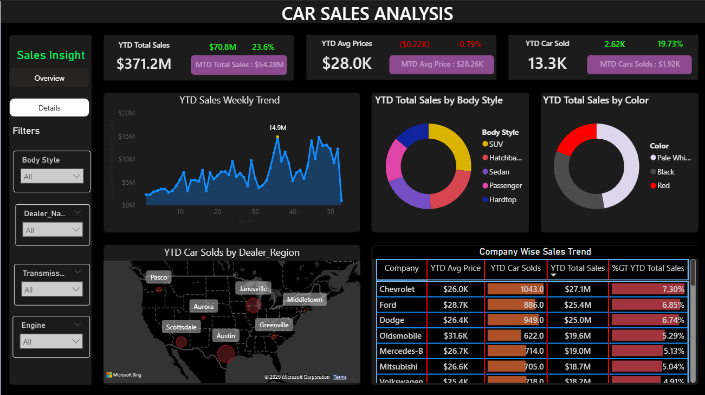
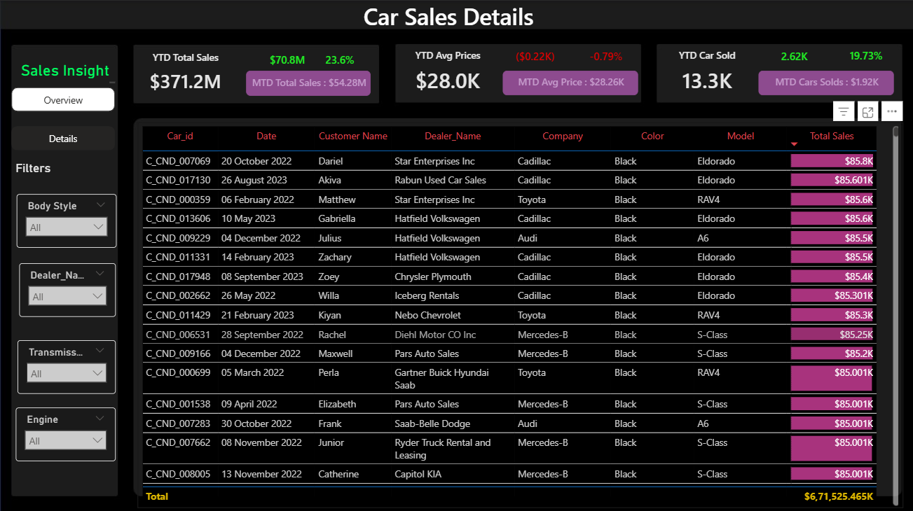

# 🚗 Car Sales Analysis Dashboard – Power BI

A comprehensive interactive dashboard built using Power BI to analyze car sales data across multiple dimensions like region, model, time, and revenue.

---

## 📸 Dashboard Preview

---

## 📊 Project Summary

This Power BI dashboard explores car sales trends across:
- Brands and models
- Sales by region and dealer
- Time-based performance (monthly, quarterly)
- Revenue and profit comparisons

It provides **interactive filters**, **drill-through analysis**, and **KPIs** to gain clear insights into business performance and decision-making.

---

## 🔍 Key Insights

- 🚗 **Top-Selling Brands**: Toyota and Ford consistently lead across regions.
- 💰 **Highest Revenue Regions**: North America and Europe generate 60%+ of revenue.
- 📉 **Decline in SUV sales**: 12% drop in Q2 due to price hikes and fuel costs.
- 📈 **Electric Vehicle (EV) Trend**: EV sales surged 30% YoY, highest in Q4.
- 🧮 **Dealer-wise Profitability**: ABC Motors leads with 18% margin across segments.

---

## 🛠️ Tools & Technologies

- **Power BI Desktop**
- **DAX (Data Analysis Expressions)**
- **Power Query for data transformation**
- **CSV dataset (custom cleaned)**
- **GitHub Pages (optional for web embedding)**

---

## 👨‍💻 Author

Developed by [Vignat Tank](https://github.com/Vignat0905) 🚀
